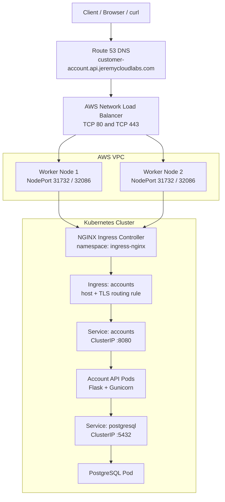
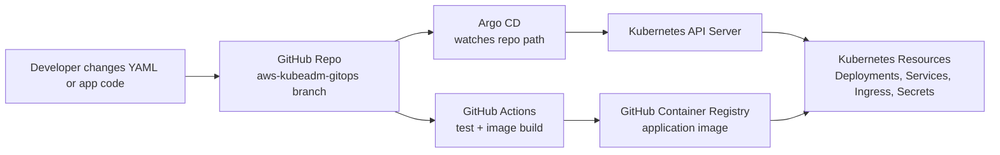
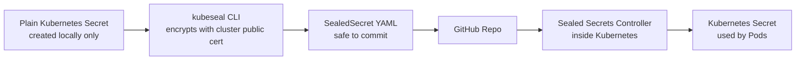

# DevOps Capstone Project: Account Service on Self-Managed Kubernetes

This repository contains a Flask-based Account REST API service and the deployment assets used to run it on a self-managed Kubernetes cluster on AWS EC2.

The project originally came from an IBM Cloud Kubernetes capstone lab. I extended it into an AWS-based DevOps portfolio project using Docker, GitHub Actions, GitHub Container Registry, kubeadm Kubernetes, Kustomize, Argo CD, Sealed Secrets, NGINX Ingress, Route 53, and HTTPS certificates from Let's Encrypt.

## Project Summary

The application is a small account management API. It exposes REST endpoints for creating, reading, updating, deleting, and listing customer account records.

Current production-style access path:

```text
https://customer-account.api.jeremycloudlabs.com/health
```

Example health response:

```json
{"status":"OK"}
```

Example root response:

```json
{"name":"Account REST API Service","version":"1.0"}
```

## Application Layer

The application is implemented as a Python Flask service.

Main components:

| Path | Purpose |
| --- | --- |
| `service/routes.py` | Defines REST API routes such as `/`, `/health`, and `/accounts` |
| `service/models.py` | Defines the `Account` SQLAlchemy model and database CRUD behavior |
| `service/metrics.py` | Defines Prometheus HTTP, business, and database instrumentation |
| `service/config.py` | Builds the database connection configuration from environment variables |
| `service/__init__.py` | Creates and initializes the Flask application |
| `service/common/` | Shared helpers for status codes, logging, CLI commands, and error handling |
| `tests/` | Unit and service tests for the API |

Core API endpoints:

| Method | Endpoint | Purpose |
| --- | --- | --- |
| `GET` | `/` | Service information |
| `GET` | `/health` | Health check endpoint |
| `GET` | `/accounts` | List accounts |
| `POST` | `/accounts` | Create an account |
| `GET` | `/accounts/{id}` | Get one account |
| `PUT` | `/accounts/{id}` | Update one account |
| `DELETE` | `/accounts/{id}` | Delete one account |

The data model includes:

| Field | Meaning |
| --- | --- |
| `id` | Account ID |
| `name` | Customer name |
| `email` | Customer email |
| `address` | Customer address |
| `phone_number` | Customer phone number |
| `date_joined` | Date the customer joined |

## Container Build Layer

The application is packaged as a Docker image.

| File | Purpose |
| --- | --- |
| `Dockerfile` | Builds the Flask app image using `python:3.9-slim` |
| `requirements.txt` | Python runtime and test dependencies |
| `gunicorn.conf.py` | Gunicorn server configuration |

Runtime behavior:

```text
Gunicorn starts the Flask app on port 8080 inside the container.
```

Current image registry:

```text
ghcr.io/jeremyrc760/devops-capstone-project
```

## CI/CD Layer

This project uses GitHub Actions for CI and image publishing.

| Workflow | Purpose |
| --- | --- |
| `.github/workflows/ci-build.yaml` | Runs linting and tests with PostgreSQL service container |
| `.github/workflows/docker-ghcr.yaml` | Builds and pushes Docker images to GitHub Container Registry |

The container image is tagged from branch and commit metadata. The AWS kubeadm GitOps deployment currently uses the image from the `aws-kubeadm-gitops` branch.

The complete delivery and monitoring flow is documented in
[`docs/architecture/ci-cd-and-monitoring.md`](docs/architecture/ci-cd-and-monitoring.md).

## Kubernetes Infrastructure

The Kubernetes cluster is self-managed on AWS EC2 using `kubeadm`.

Current cluster shape:

| Node | Role | Purpose |
| --- | --- | --- |
| `k8s-control-plane-1` | Control plane | Runs Kubernetes API server, scheduler, controller manager, and etcd |
| `k8s-worker-1` | Worker | Runs application and platform pods |
| `k8s-worker-2` | Worker | Runs application and platform pods |
| `k8s-monitoring-1` | Monitoring worker | Runs the manually assembled Prometheus and Grafana stack |

Installed cluster components:

| Component | Purpose |
| --- | --- |
| kubeadm | Bootstraps the Kubernetes control plane and worker nodes |
| kubelet | Node agent that runs pods |
| kubectl | Kubernetes CLI |
| containerd | Container runtime |
| Calico | Pod networking / CNI |
| NGINX Ingress Controller | HTTP/HTTPS ingress entry point inside the cluster |
| Argo CD | GitOps controller and UI |
| Sealed Secrets | Git-safe encrypted Kubernetes secrets |
| cert-manager | Automated TLS certificate management |

## AWS Infrastructure

The self-managed Kubernetes cluster runs inside a dedicated AWS VPC.

| AWS Resource | Purpose |
| --- | --- |
| VPC | Isolated network for the Kubernetes lab |
| Public subnet | Subnet where EC2 Kubernetes nodes run |
| Internet Gateway | Allows public internet traffic in and out of the VPC |
| Route Table | Routes `0.0.0.0/0` to the Internet Gateway and VPC CIDR locally |
| Security Groups | Controls SSH, NodePort, HTTP, and HTTPS access |
| EC2 instances | One control plane, two application workers, and one monitoring worker |
| Network Load Balancer | Stable public entry point for HTTP/HTTPS traffic |
| Route 53 | DNS record for the API domain |

## External Traffic Architecture

The external request path is:



Important detail: the NGINX Ingress Controller runs as Kubernetes pods on worker nodes. The AWS NLB targets the worker nodes' NodePort ports, then the Ingress Controller reads the Kubernetes Ingress rule and forwards traffic to the correct internal service.

## GitOps Architecture

Argo CD watches this repository and applies the Kubernetes manifests from the GitOps branch.

Current Argo CD applications:

| Application | Source path | Namespace | Purpose |
| --- | --- | --- | --- |
| `accounts` | `deploy/applications/accounts/kustomize/overlays/aws-kubeadm` | `accounts` | Active Accounts API deployment |
| `accounts-helm-dev` | `deploy/applications/accounts/helm` | `accounts-helm-dev` | Helm learning/dev deployment |
| `monitoring` | `deploy/platform/monitoring/helm` | `monitoring` | Helm monitoring migration target |

All three use the `aws-kubeadm-gitops` branch. The active monitoring stack is
still the manually applied `monitoring-manual` namespace, not the `monitoring`
Argo CD Application.

GitOps flow:



## Deployment Manifests

Deployment assets are grouped by ownership under `deploy/applications/` and
`deploy/platform/`. See [`deploy/README.md`](deploy/README.md) for the complete
layout.

### Earlier AWS kubeadm Manifests

```text
archive/aws-kubeadm-manual/
```

This archived directory documents the earlier manual deployment approach. It is useful as a learning record of how the app was first deployed to the self-managed cluster, but it is not part of the current GitOps deployment.

### Kustomize GitOps Manifests

```text
deploy/applications/accounts/kustomize/
```

This is the current GitOps deployment structure.

| Path | Purpose |
| --- | --- |
| `deploy/applications/accounts/kustomize/base/` | Shared Kubernetes resources |
| `deploy/applications/accounts/kustomize/overlays/aws-kubeadm/` | Current AWS kubeadm cluster deployment |
| `deploy/applications/accounts/kustomize/overlays/dev/` | Development-style overlay |
| `deploy/applications/accounts/kustomize/overlays/prod/` | Production-style overlay |

Current base resources:

| Resource | Purpose |
| --- | --- |
| `Namespace` | Creates the `accounts` namespace |
| `ConfigMap` | Stores non-sensitive app configuration such as `DATABASE_HOST` |
| `SealedSecret` | Stores encrypted PostgreSQL credentials safely in Git |
| `Deployment/accounts` | Runs the Account API pods |
| `Service/accounts` | Internal service for the Account API |
| `ServiceMonitor/accounts` | Tells Prometheus to scrape the Accounts API `/metrics` endpoint |
| `Deployment/postgresql` | Runs PostgreSQL for the lab environment |
| `Service/postgresql` | Internal database service |
| `Ingress/accounts` | Routes public HTTP/HTTPS traffic to the Account API |

## Secrets Management

The PostgreSQL credentials are managed with Bitnami Sealed Secrets.

Why this matters:

```text
A normal Kubernetes Secret is only base64 encoded, not encrypted.
A SealedSecret is encrypted for this specific cluster and can be committed to Git safely.
The Sealed Secrets controller decrypts it inside the cluster and creates the real Secret.
```

Current secret flow:



The public certificate is stored under:

```text
deploy/platform/sealed-secrets/sealed-secrets-public-cert.pem
```

This certificate is public by design. The private key remains inside the Kubernetes cluster.

## HTTPS and TLS

HTTPS is provided by cert-manager and Let's Encrypt.

| Component | Purpose |
| --- | --- |
| `ClusterIssuer` | Tells cert-manager how to request certificates from Let's Encrypt |
| HTTP-01 challenge | Lets Let's Encrypt verify domain ownership over HTTP |
| `Certificate` | Represents the requested TLS certificate |
| `accounts-tls` Secret | Stores the final TLS certificate and private key inside Kubernetes |
| Ingress TLS config | Uses the certificate for HTTPS traffic |

Current HTTPS result:

```text
https://customer-account.api.jeremycloudlabs.com/health
```

Expected response:

```json
{"status":"OK"}
```

HTTP currently redirects to HTTPS using the NGINX Ingress annotation:

```text
nginx.ingress.kubernetes.io/ssl-redirect: "true"
```

## Application Observability

The Accounts API exposes Prometheus metrics at `/metrics`. The
`ServiceMonitor/accounts` resource discovers the Accounts Service and instructs
Prometheus to scrape every backing Pod on the named `http` port every 30
seconds.

```text
Accounts request -> Flask instrumentation -> /metrics
                 -> ServiceMonitor -> Prometheus -> Grafana
```

Application metrics:

| Metric | Type | Purpose |
| --- | --- | --- |
| `accounts_http_requests_total` | Counter | Request volume and status codes by method and route |
| `accounts_http_request_duration_seconds` | Histogram | Request latency distribution by method and route |
| `accounts_http_requests_in_progress` | Gauge | Requests currently being processed |
| `accounts_operations_total` | Counter | Create, list, read, update, and delete outcomes |
| `accounts_db_operation_duration_seconds` | Histogram | SQLAlchemy CRUD operation latency |
| `accounts_db_errors_total` | Counter | Database failures by operation |
| `accounts_service_info` | Info | Static application version information |

The route label uses Flask route templates such as
`/accounts/<int:account_id>`. Account IDs, names, email addresses, and other
customer data are never used as Prometheus labels. `/health` and `/metrics` are
excluded from the application request counters so Kubernetes probes and
Prometheus scrapes do not distort business traffic.

The public Ingress exposes only `/`, `/health`, and `/accounts`. It does not
route `/metrics`, so application internals remain available to Prometheus over
the cluster network without being published through the API domain.

Example PromQL queries:

```promql
sum by (method, route) (rate(accounts_http_requests_total[5m]))
```

```promql
100 *
sum(rate(accounts_http_requests_total{status_code=~"5.."}[5m]))
/
clamp_min(sum(rate(accounts_http_requests_total[5m])), 0.001)
```

```promql
histogram_quantile(
  0.95,
  sum by (le, route) (
    rate(accounts_http_request_duration_seconds_bucket[5m])
  )
)
```

The monitoring stack must be installed before applying the Kustomize overlay
because `ServiceMonitor` is a Prometheus Operator custom resource.

The currently active monitoring manifests live in
`deploy/platform/monitoring/manual/` and run in `monitoring-manual`. Grafana
stores dashboards, contact points, and Grafana-managed alert rules on a 5 GiB
local `hostPath` PV on `k8s-monitoring-1`. Prometheus still uses `emptyDir`, so
its historical metrics are lost if the Prometheus Pod is recreated.

## Useful Commands

Check application health through the public domain:

```bash
curl https://customer-account.api.jeremycloudlabs.com/health
```

Check all resources in the application namespace:

```bash
kubectl get all -n accounts
```

Check the Ingress resource:

```bash
kubectl get ingress -n accounts
```

Check the TLS certificate:

```bash
kubectl get certificate -n accounts
```

Check Argo CD application status:

```bash
kubectl get application accounts -n argocd
```

Check application scrape discovery and metrics:

```bash
kubectl get servicemonitor accounts -n accounts
kubectl port-forward -n accounts svc/accounts 8081:8080
curl http://localhost:8081/metrics
```

Render the current AWS kubeadm Kustomize overlay locally:

```bash
kubectl kustomize deploy/applications/accounts/kustomize/overlays/aws-kubeadm
```

## Current Status

The project currently demonstrates:

- A Python Flask REST API containerized with Docker
- GitHub Actions CI and container image publishing to GHCR
- A self-managed Kubernetes cluster on AWS EC2
- Calico networking across one control plane and three worker nodes
- Argo CD GitOps deployment from a dedicated branch and Kustomize overlay
- PostgreSQL running inside Kubernetes for the lab environment
- Sealed Secrets for encrypted Git-based secret management
- NGINX Ingress Controller for HTTP/HTTPS routing
- AWS Network Load Balancer as the public entry point
- Route 53 custom domain integration
- cert-manager and Let's Encrypt HTTPS certificate automation
- Prometheus application instrumentation and ServiceMonitor discovery
- Grafana dashboards and email alerts backed by the active manual monitoring stack

## Future Improvements

Potential next steps:

- Move PostgreSQL from in-cluster `Deployment` to AWS RDS PostgreSQL
- Add persistent storage for the in-cluster PostgreSQL demo
- Manage AWS infrastructure with Terraform
- Use ExternalDNS to manage Route 53 records from Kubernetes
- Add application SLO-based Prometheus alerts and a custom Grafana dashboard
- Add structured application logs and centralized log collection
- Add a frontend client for the Account API
- Add production and development Argo CD Applications using separate overlays

## License

This project is based on the IBM Developer Skills Network capstone starter project and keeps the original Apache License 2.0 license.
